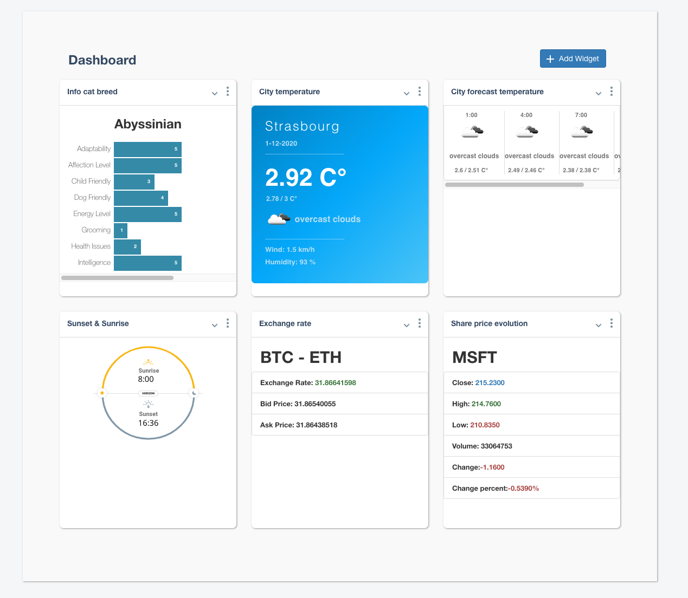
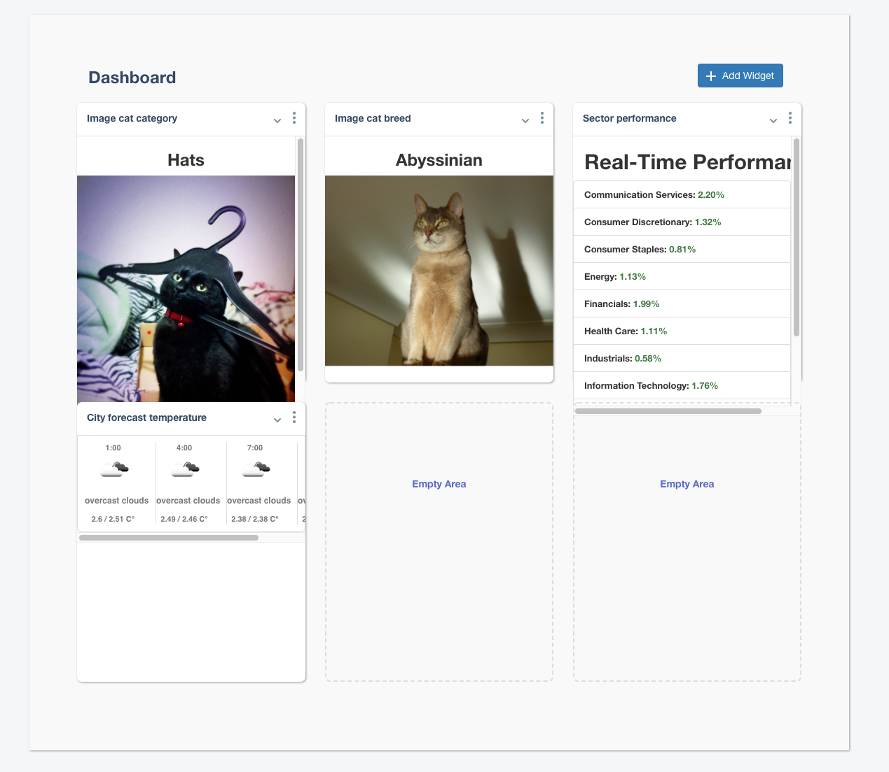
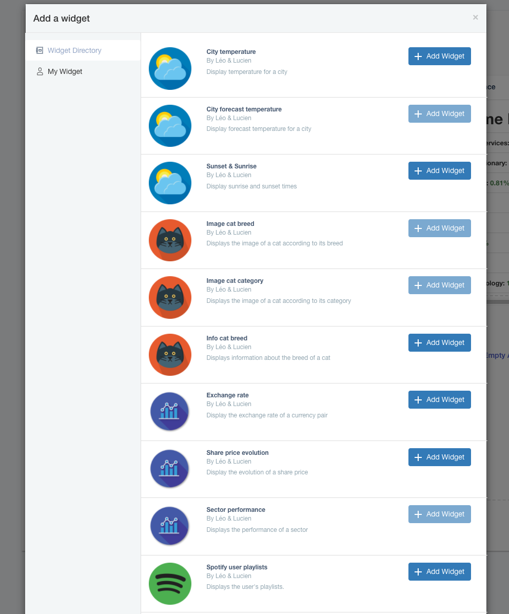
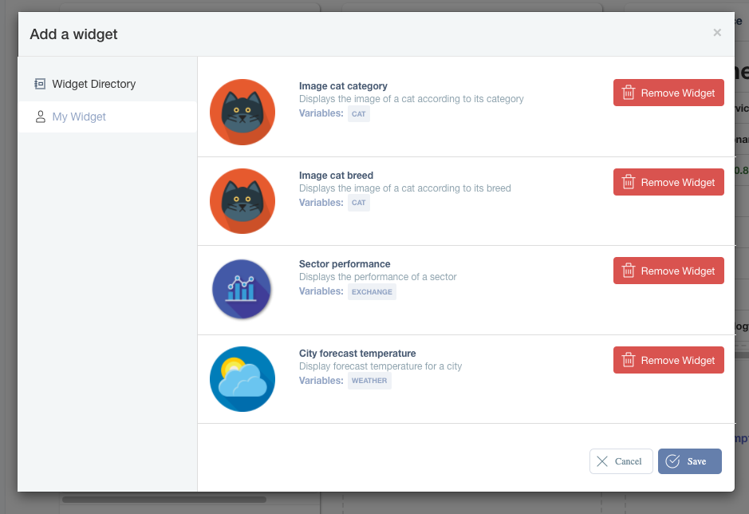

# Services
## Weather
- Display temperature for a place.
- Display forecast temperatures for a place.
- Display the time of sunrise and sunset for a place.

## Exchange
- Display the exchange rate of a currency pair.
- Display the evolution of a share price.
- Display the performance of a sector.

## Cat
- Display the image of a cat according to its breed.
- Display the image of a cat according to its category.
- Display information about the breed of a cat.

## Spotify
- Display the user's playlists.
- Display the user's saved albums.

# Architecture

## What are microservices?
Microservices - also known as the microservice architecture - is an architectural style that structures an application as a collection of services that are
- Highly maintainable and testable
- Loosely coupled
- Independently deployable
- Organized around business capabilities
- Owned by a small team

The microservice architecture enables the rapid, frequent and reliable delivery of large, complex applications. It also enables an organization to evolve its technology stack.

# Documentation

Each service includes documentation generated by apiDoc. You just have to launch it by running `open doc/index.html` from the service folder.

# How to use?

## Add a service
To add a service to the Dashboard you need:
1) Create a folder with the suffix "service".
2) Copy an existing service.
3) Replace the values of the config file and its .env in the "config" folder by the right values such as the token and the path prefix of the API.
4) Make sure that the port of your .env is the same as the port of your Dockerfile.
5) Replace the file containing the template of your answer in the "model" folder.
6) Replace the file containing your API response in the "delivery" folder.
7) Replace the files contained in the "api" folder by adding the new methods of the service.
8) Document your API.
9) Generate a documentation by running `npm doc`.
10) Add these methods to the unit test file in the "api" folder.
11) Test your API by running `npm test`.
12) Add your container in the docker-composes at the root of the project.
13) Add your service to the Nginx reverse proxy in the "nginx.conf" file in the "nginx" folder.
14) Register your service in "front-end/src/API/widgetsAPI.js".
15) Create your widget component in "front-end/src/API/Widgets" in a folder with the name of your service.
16) Create the setting component of your widget in the same folder.

## Start the Dashboard
1) Run `docker-compose build && docker-compose up`
2) Go to http://localhost:8080

# Previews

